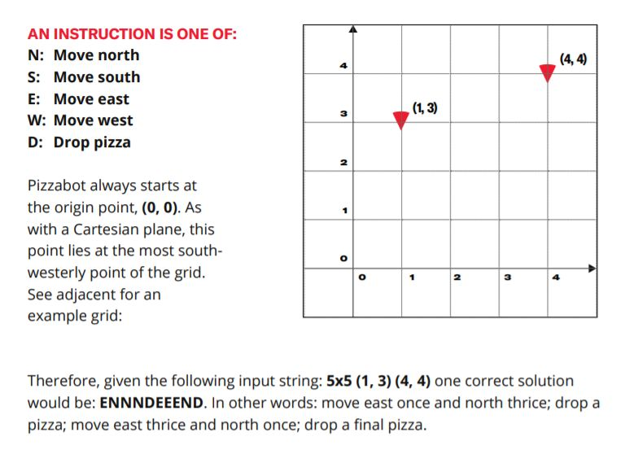
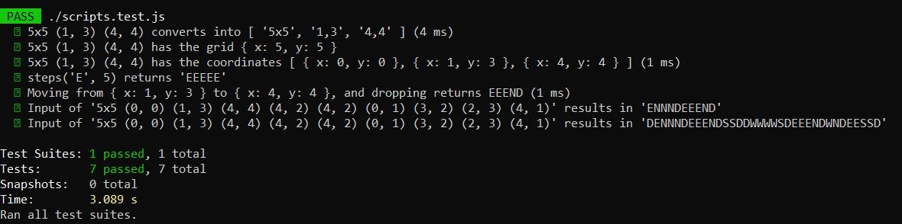

# Pizzabot

This is a `node.js` application that takes in a string command, and outputs a directions string.

```bash
node pizzabot.js "5x5 (1, 3) (4, 4)"

# result: ENNNDEEEND
```



# Unpack

The project was compressed with the following command:

```
tar -cvzf slice.tar.gz *.json *.js *.md pics
```

Use this command to extract the contents:

```
tar -xvzf slice.tar.gz
```

# Tests

To run the `jest` tests, use the following CLI commands:

### install

```
npm i
```

### run tests

```
npm test
```

You should see this output


